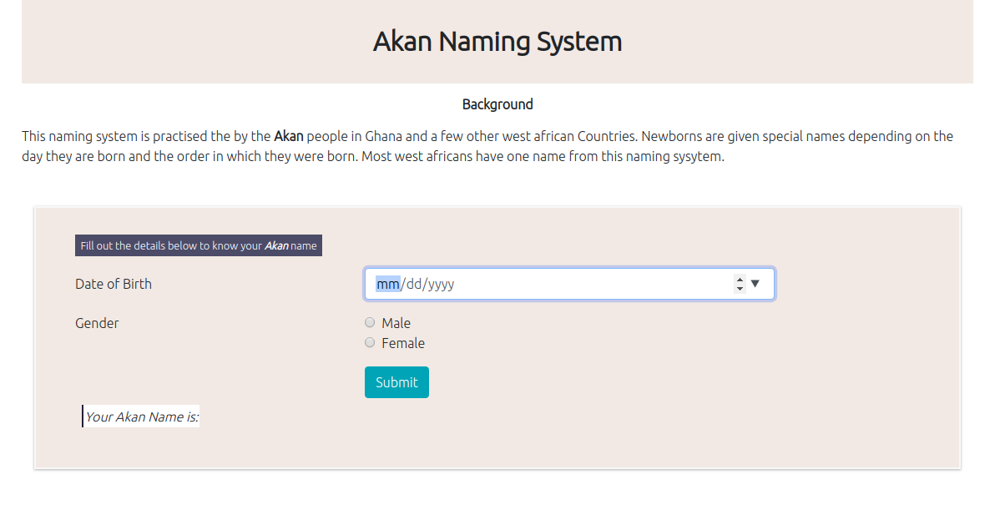

# Akan Generator
Akan Generator is a simple web app that allows the user to input His/Her birthdate and gender and it returns his/her **Akan**(A naming system practised by some west African countries) name.

## Prerequisites
- Have Git installed.
- Have a text editor installed e.g VS Code, Atom
### Technologies Used
- HTML, CSS, Bootstrap and JavaScript
- Any text editor of your choise.
### Setup Installation
To run the application:-
1. Clone the repository to a folder in your machine using `https://github.com/joanwanjiku/Akan.git`
2. Cd to that folder.
3. `code .`, if you are using VS code.
4. Open index.html on your browser.
### Behaviour Driven Development

#### Author
- Joan Wanjiku
    - joanevans18@gmail.com
#### License
Copyright &copy; 2020, Joan Evans
